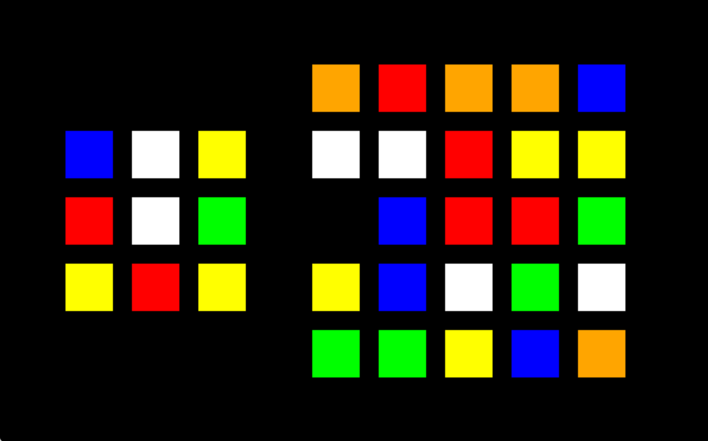

# rubiksRace
A sliding puzzle based on the board game Rubik's Race. It is an object-oriented game implemented with pygame.

## Getting Started
Run the game on [repl](https://replit.com/@nellbrodkin/rubiksRace) or:
1. Get Python 3.x and clone this repository
2. Get [pip](https://www.makeuseof.com/tag/install-pip-for-python/), then install pygame:\
    ```$ pip install pygame```
3. Run the game:\
    ```$ python graphics.py```

## Play
- Click on tiles to move them around
- Tiles can only slide into an empty space (black)
- Goal: match inerior tiles of board (right) to reference tiles (left)


